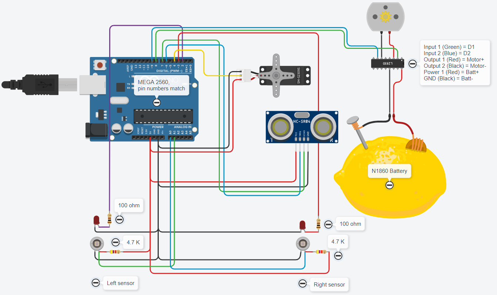

# Line follower

Repository to build and program a line follower robot with arduino MEGA 2560.

The robot follows a line with two IR sensors and senses objects in front using ultrasound.

Course project for GCMG - Computational Graphics and Geometric Modelling of Técnico Lisboa.

## Arduino schematic

Parts:
- 2 x TCRT5000 IR LED / photodiode combo
- Ultrasound sensor HC-SR04
- 2 x 100 ohm resistors
- 2 x 4.7 kohm resistors
- N18650 battery
- Small DC motor
- SG90 micro servo
- QUDONG BOSUN K-MEN motor controller (4-channel L9110)
- Whole lot of wire and soldering supplies

## Instructions

1. Build the electronics
2. Load the code to your arduino
3. Double check the pins in code and physical world

## Usage

The bot is autonomous. As long as it receives power, the program will run.

## Contributing

Unfortunately this project is my coursework, hence I am unable to receive external contributions. You can buy me a coffee if we meet though.

## License
[MIT](https://choosealicense.com/licenses/mit/)